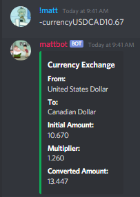
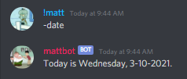
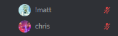
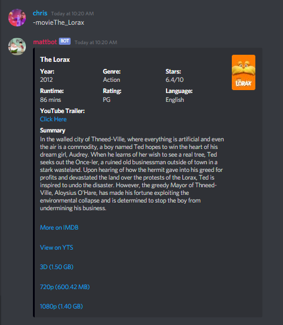
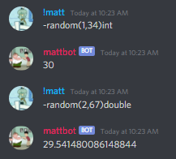
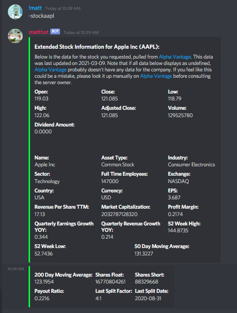
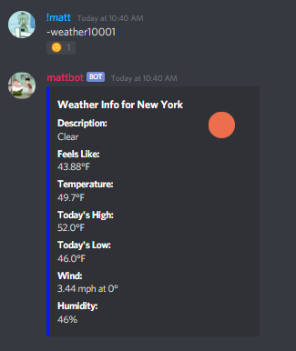

## Welcome to My All-Purpose Discord Bot  

#### Using this bot, you can make it perform a wide variety of tasks! Here are a list of commands that I have implemented for my Discord bot:  

 

* Allow
	* Grant access to a private voice channel, which adds permission to the voice channel for the @mention to connect. The person that will then be allowed into the voice channel is granted the ability to view and connect to the channel. Note: You must be the private voice channel creator in order to do this.

	Command Usage Example:
	  
	
	  
	Permission Changes:
	  
	

* Currency
	* Get current currency exchange information, formatted as "-currency[from code][to code][price]". Use -currencycodes for a list of codes.

	Currency Codes:
	  
	
	  
	Example Usage:
	  
	

* Date
	* Displays the current date.

	Example Usage:
	  
	

* Help
	* Open the help dialog to see which commands are available to use.
* How
	* How was this bot created?
* Info
	* Displays information about Matt's server.
* Mute
	* (-m) Mute all in a voice channel (Admins only). See u command for unmuting all in a voice channel.

	What Happens:
	  
	

* Minecraft
	* Displays Matt's Minecraft server information. You can easily replace this server link yourself.
* Movie
	* Displays information about any movie. Use underscores (_) for spaces in movie titles.

	Example Usage:
	  
	

* Time
	* Displays the current time.
* Random
	* Generate a random number using the following scheme: "-random(min,max)int". Use "int" for integer, or "double" for decimal number.

	Example Usage:
	  
	

* Remove
	* Remove connection permission from the @mention to the private voice channel, and disconnect from the voice channel if they are currently in it. Note: You must be the private voice channel owner in order to do this. Command usage is the same as the allow command.
* Rename
	* Rename any voice channel within our friend group's channels. Granting the edit permission to the role would also allow creation and deletion of channels, so this was the best option for renaming. Use -rename[old channel name]-[new channel name]
* Stock
	* Gets stock info for a given symbol. Use -stockinfo to get the info you want; be sure to follow the format -stock[symbol]:[info] without the brackets.

	Example Usage:
	  
	

* Unmute
	* (-u) Unmute all in a voice channel (Admins only).

	What Happens:
	  
	

* Uptime
	* Gets my uptime.
* Weather
	* Get weather for any zip code, for example, "-weather10001" will show the weather for New York City.

	What Happens:
	  
	

* Website
	* View Matthew Vandenberg's website.
   
The possibilities are endless! I use Heroku to host my bot, so that when I make a change to my bot.js file and commit the changes to GitHub, it will automatically restart to bot to reflect the new changes!
